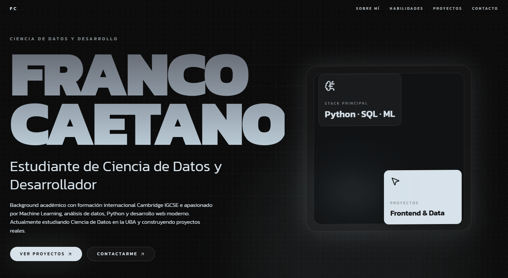

# Franco Caetano — Portfolio

Portfolio personal desarrollado con React, TypeScript, Tailwind CSS y Framer Motion.

Diseñado para mostrar proyectos de desarrollo web, interfaces modernas y futuros proyectos relacionados con Data Science y Machine Learning.

---

## Preview



---

## Tecnologías

- React
- TypeScript
- Tailwind CSS
- Framer Motion
- Vite
- Laravel

---

## Proyectos

### Martina Studio
Sitio web moderno de accesorios con catálogo de productos, experiencia de compra y backend desarrollado con Laravel para la gestión de productos y contenido.

### GEPCORP
Sitio web corporativo para una empresa de consultoría energética enfocado en diseño responsive, presentación profesional y experiencia moderna.

### Próximamente
Nuevos proyectos relacionados con Data Science, análisis de datos y Machine Learning.

---

## Demo

🔗 https://TU-LINK-VERCEL.vercel.app

---

## Instalación

```bash
npm install
npm run dev
```

## Contacto
[LinkedIn:](https://www.linkedin.com/in/francocaetano/)
GitHub: https://github.com/FrancoCae
Email: francocaetano20@gmail.com
